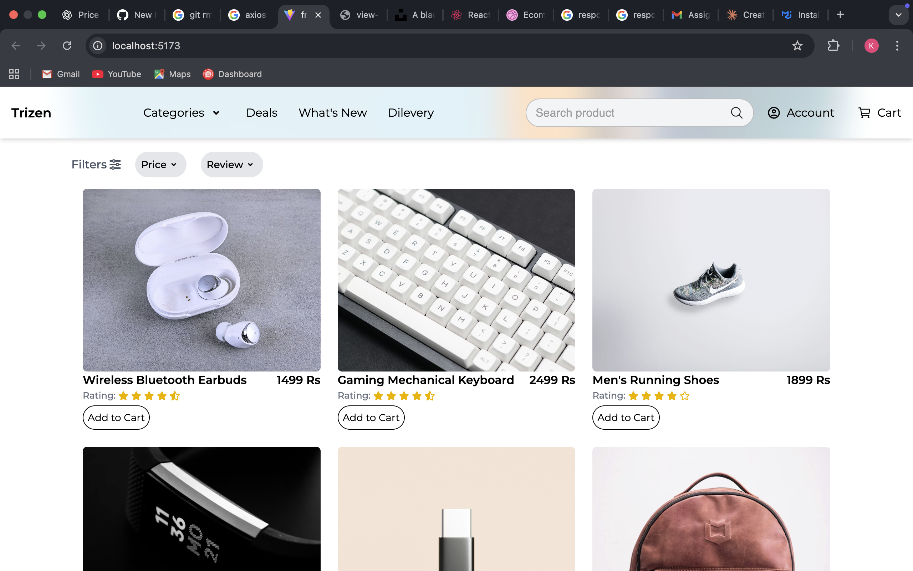

# 🛍️ Trizen Assignment - Ecommerce Website

A modern, full-featured ecommerce platform built to deliver seamless shopping experiences with a focus on performance, user experience, and scalability.

## 📋 Table of Contents

- [About](#about)
- [Features](#features)
- [Tech Stack](#tech-stack)
- [Getting Started](#getting-started)
  - [Prerequisites](#prerequisites)
  - [Installation](#installation)
  - [Running the Application](#running-the-application)
- [Project Structure](#project-structure)
- [Usage](#usage)
- [API Documentation](#api-documentation)
- [Screenshots](#screenshots)
- [Contributing](#contributing)
- [License](#license)
- [Contact](#contact)

## 🎯 About

This ecommerce website is a comprehensive solution that enables users to browse products, manage their shopping cart, process orders, and complete secure checkout. Built with modern web technologies, it provides both customers and administrators with powerful tools to manage the entire shopping experience.

### Key Highlights

- **User-Friendly Interface**: Clean, intuitive design for effortless navigation
- **Responsive Design**: Optimized for desktop, tablet, and mobile devices
- **Secure Transactions**: Industry-standard security practices for payment processing
- **Real-Time Updates**: Dynamic cart and inventory management
- **Admin Dashboard**: Comprehensive backend for product and order management

## ✨ Features

### Customer Features
- 🔍 Advanced product search and filtering
- 📦 Product catalog with categories

## 🛠️ Tech Stack

### Frontend
- **Framework**: React.js
- **Styling**: Tailwind CSS, MUI
- **HTTP Client**: Axios

### Backend
- **Runtime**: Node.js
- **Framework**: Express.js
- **Database**: MongoDB

## 🚀 Getting Started

### Prerequisites

Before you begin, ensure you have the following installed:
- Node.js (v14.0 or higher)
- npm or yarn
- MongoDB
- Git

### Installation

1. **Clone the repository**
   ```bash
   git clone https://github.com/kapish666/trizen-assignment.git
   cd trizen-assignment
   ```

2. **Install dependencies**
   ```bash
   # Install server dependencies
   cd backend
   npm install

   cd ..
   cd frontend
   npm install
   ```

3. **Environment Configuration**

   Create a `.env` file in the backend directory and add the following variables:
   ```env
   # Server Configuration
   PORT=5000
   
   # Database
   MONGODB_URI=your_mongodb_connection_string
   ```

4. **Database Setup**
   ```bash
   # Seed the database with sample data (optional)
   cd backend
   node seed.js
   ```

### Running the Application

#### Development Mode

```bash
# Run backend server
cd backend
node server.js

# In a new terminal, run frontend
cd frontned
npm run dev
```

The application will be available at:
- Frontend: `http://localhost:3000`
- Backend API: `http://localhost:5000`


## 📸 Screenshots

### Homepage


### Product Shown


### Searchbar


### Price filter


### Rating filter


## 📧 Contact

**Kapish**

- GitHub: [@kapish666](https://github.com/kapish666)
- Project Link: [https://github.com/kapish666/trizen-assignment](https://github.com/kapish666/trizen-assignment)

⭐ If you find this project useful, please consider giving it a star!

**Made with ❤️ by Kapish**
